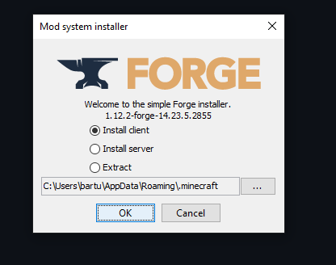

# MC server 1.12.2

## Instuctions

### Step 1: Downloading Mods

> Code --> Download ZIP
> 
> Unzip to a safe location for later use. You'll only need the folder "mods"

### Step 2: Downloading and Installing Forge

> Download [minecraft forge 1.12.2](https://files.minecraftforge.net/net/minecraftforge/forge/index_1.12.2.html) 
> Install Client
> 
> Wait...
> Launch MC with forge
> Exit out of MC

### Step 3: Installing Mods

> Open .minecraft Should be at C:\Users\\(user)\AppData\Roaming\\.minecraft
> 
> Locate mods folder
> 
> Open the mods folder you downloaded and copy everything (ctrl+A -> ctrl+C) from there to .minefract\mods (ctrl+V)
> 

### Step 4: Done

> Done
